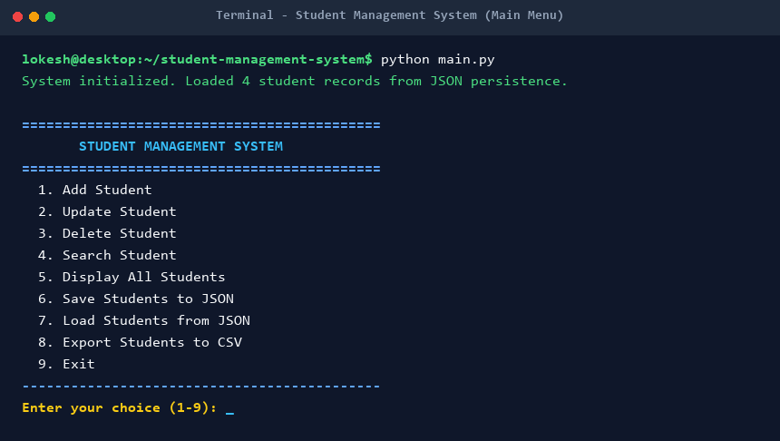
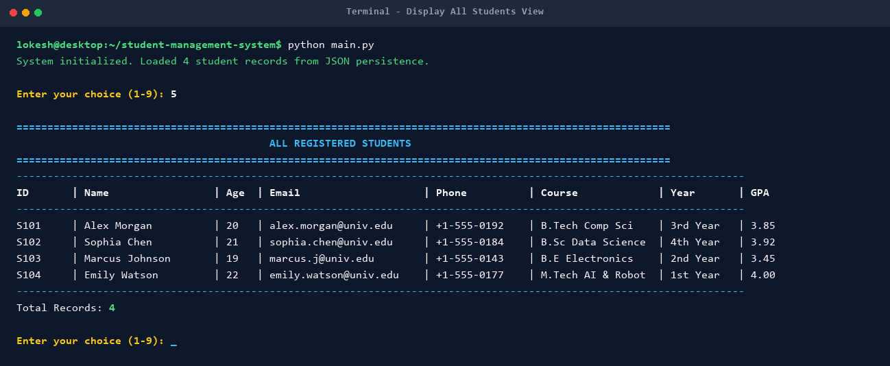
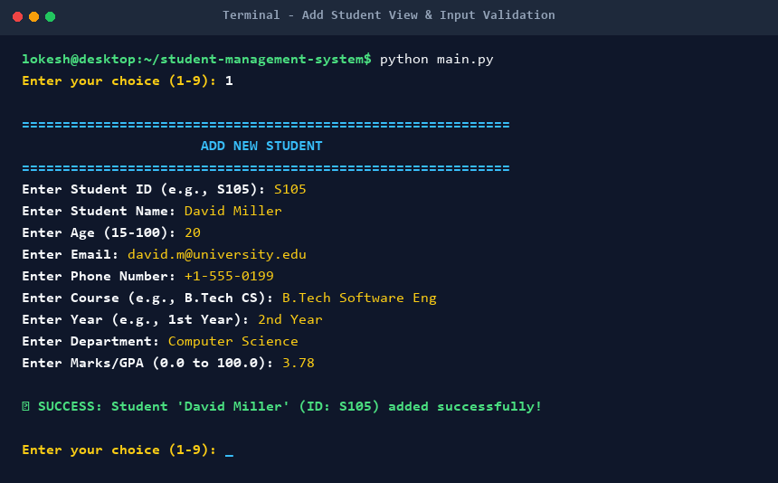
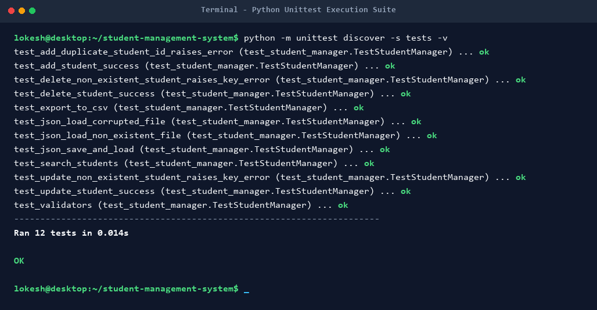

# Console-Based Student Management System

A clean, modular, and professional **Console-Based Student Management System** written in **Python 3.13** following Object-Oriented Programming (OOP) principles, clean coding standards (PEP 8), JSON persistence, and CSV export.

Designed for Python Full Stack Development internships, academic projects, and clean software architecture demonstrations.

---

## 🌟 Key Features

1. **Add Student**: Register new students with unique Student IDs and input validations.
2. **Update Student**: Modify existing student attributes safely while maintaining Student ID uniqueness.
3. **Delete Student**: Delete student records with explicit interactive confirmation prompts.
4. **Search Student**: Multi-field search by Student ID, Name, Course, Department, or All fields.
5. **Display All Students**: Render all registered students in a formatted ASCII table view.
6. **Save to JSON**: Persistent storage of student records in `data/students.json` using atomic safe-writing.
7. **Load from JSON**: Automatic or manual loading of student records from JSON with corruption handling.
8. **Export to CSV**: Export student records into `data/students.csv` for reporting or spreadsheet software.
9. **Input Validation**: Strict validation for required non-empty fields, email format, phone format, age range, and GPA/marks range.
10. **Exception Handling**: Safe handling of `ValueError`, `FileNotFoundError`, `json.JSONDecodeError`, `PermissionError`, and `KeyError`.

---

## 🛠️ Technologies Used

- **Programming Language**: Python 3.13+
- **Architecture**: Object-Oriented Programming (OOP)
- **Data Formats**: JSON (`json`), CSV (`csv`)
- **Testing Framework**: Python Standard Library `unittest`
- **Dependencies**: 100% Python Standard Library (No external `pip` packages required)

---

## 🏗️ Object-Oriented Structure

The application is structured into well-defined components following single responsibility and clean architecture principles:

- **`Student` (`models/student.py`)**: Data model representing individual student entities with attributes, dictionary conversion (`to_dict()`, `from_dict()`), and formatted string representations.
- **`StudentManager` (`services/student_manager.py`)**: Service class orchestrating in-memory CRUD operations, search indexing, persistence, and CSV export.
- **`FileHandler` (`utils/file_handler.py`)**: Utility class performing safe JSON read/write (atomic file swap) and CSV exporting with context managers.
- **`Validator` (`utils/validators.py`)**: Utility class providing regex and rule-based validation routines for user inputs.
- **`StudentApp` (`main.py`)**: User interface loop providing interactive menus, colored console output, and input handling.

---

## 📂 Project Folder Structure

```
CONSOLE-BASED STUDENT MANAGEMENT SYSTEM/
│
├── main.py                     # Program entrypoint and interactive CLI menu
│
├── models/                     # Data models
│   ├── __init__.py
│   └── student.py              # Student class definition
│
├── services/                   # Business logic and CRUD services
│   ├── __init__.py
│   └── student_manager.py      # StudentManager service
│
├── utils/                      # Utilities and helpers
│   ├── __init__.py
│   ├── file_handler.py         # JSON and CSV file operations
│   └── validators.py           # Input validation rules & regex
│
├── data/                       # Data persistence directory
│   ├── students.json           # JSON persistent data storage
│   └── students.csv            # Exported CSV data file
│
├── tests/                      # Automated unit test suite
│   ├── __init__.py
│   └── test_student_manager.py # Test cases for StudentManager and Validator
│
├── screenshots/                # Application screenshots folder
├── .gitignore                  # Git ignore file
├── README.md                   # Project documentation
└── requirements.txt            # Dependency documentation
```

---

## 💻 Installation & Setup

### Prerequisites

Ensure you have **Python 3.13** or higher installed on your system. You can verify your Python version by running:

```bash
python --version
```

### Setting Up a Virtual Environment

#### On Windows (PowerShell / Command Prompt):
```powershell
python -m venv venv
venv\Scripts\activate
```

#### On macOS / Linux:
```bash
python3 -m venv venv
source venv/bin/activate
```

### Installing Dependencies

Since this project utilizes Python's robust Standard Library, **no external third-party dependencies are required**. You can verify setup by checking `requirements.txt`:

```bash
pip install -r requirements.txt
```

---

## 🚀 How to Run the Application

Execute `main.py` from the root directory of the project:

```bash
python main.py
```

---

## 📖 How to Use

When launched, the application displays an interactive terminal menu:

```text
============================================
       STUDENT MANAGEMENT SYSTEM       
============================================
  1. Add Student
  2. Update Student
  3. Delete Student
  4. Search Student
  5. Display All Students
  6. Save Students to JSON
  7. Load Students from JSON
  8. Export Students to CSV
  9. Exit
--------------------------------------------
Enter your choice (1-9):
```

### Options Overview:

1. **Add Student**: Enter student details (ID, Name, Age, Email, Phone, Course, Year, Department, GPA). Input validation ensures email, phone, age, and ID uniqueness are valid.
2. **Update Student**: Provide Student ID, view existing attributes, and enter new values or press `ENTER` to retain existing field values.
3. **Delete Student**: Provide Student ID, review the details, and confirm deletion with `y/N`.
4. **Search Student**: Choose a filter (ID, Name, Course, Department, or All) and enter search keywords.
5. **Display All Students**: View all registered students in a formatted ASCII grid.
6. **Save to JSON**: Explicitly persist current in-memory student records to `data/students.json`.
7. **Load from JSON**: Reload records from `data/students.json`.
8. **Export to CSV**: Write all current records into `data/students.csv`.
9. **Exit**: Terminate the application loop cleanly.

---

## 💾 Data Persistence & CSV Export

### JSON Persistence (`data/students.json`)
- Stores student data in structured JSON format.
- Uses **atomic write replacement** (`os.replace`) via temporary files to prevent data corruption during unexpected power or system interruptions.
- Handles missing or corrupted JSON files gracefully without crashing.

### CSV Export (`data/students.csv`)
- Exports records into standard comma-separated values format compatible with Excel, Google Sheets, or data analysis tools.

---

## 🧪 Running Unit Tests

The project includes automated unit test cases using Python's `unittest` module, covering CRUD operations, validations, persistence, and error handling.

To run all unit tests, execute:

```bash
python -m unittest discover -s tests
```

Expected Output:
```text
............
----------------------------------------------------------------------
Ran 12 tests in 0.024s

OK
```

---

## 📸 Screenshots

Below are screenshots demonstrating the application views and unit test execution:

### 1. Main Menu


### 2. Display All Students Table


### 3. Add Student Form & Validation


### 4. Unit Test Suite Execution


---

## 🔮 Future Improvements

- Add pagination support for large datasets of 10,000+ students.
- Implement sorting features (by Name, GPA, Year, ID).
- Add support for SQLite/SQL database backends.
- Build a lightweight Web API or GUI (e.g., Tkinter/PyQt) interface.
