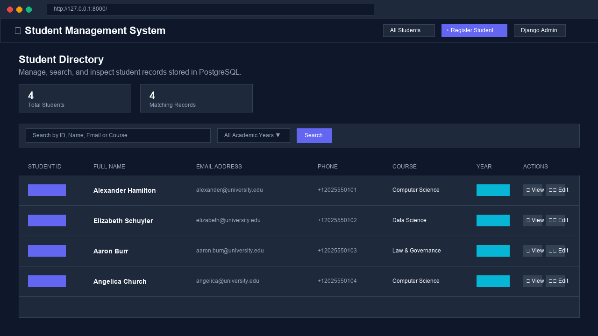
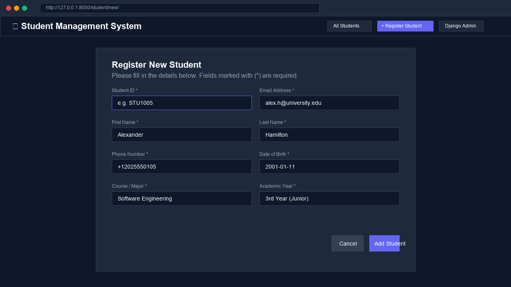
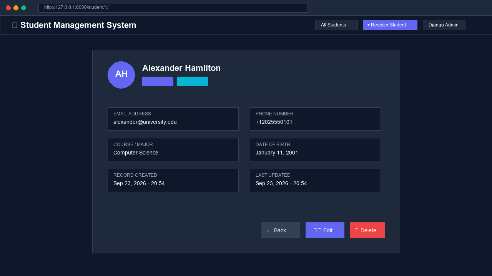
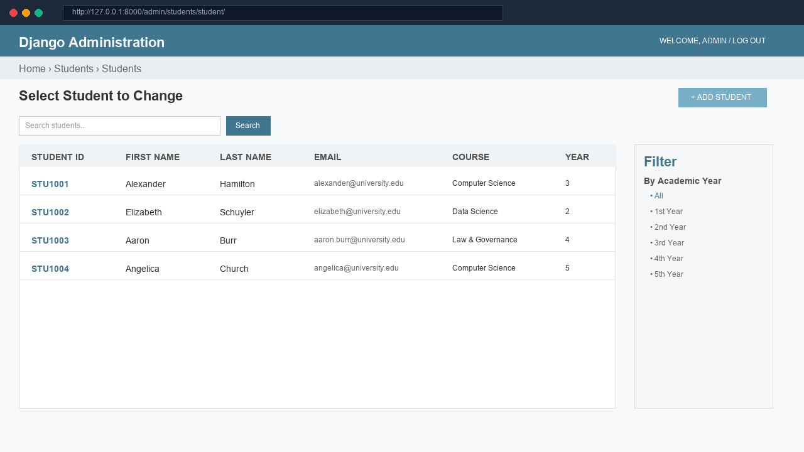
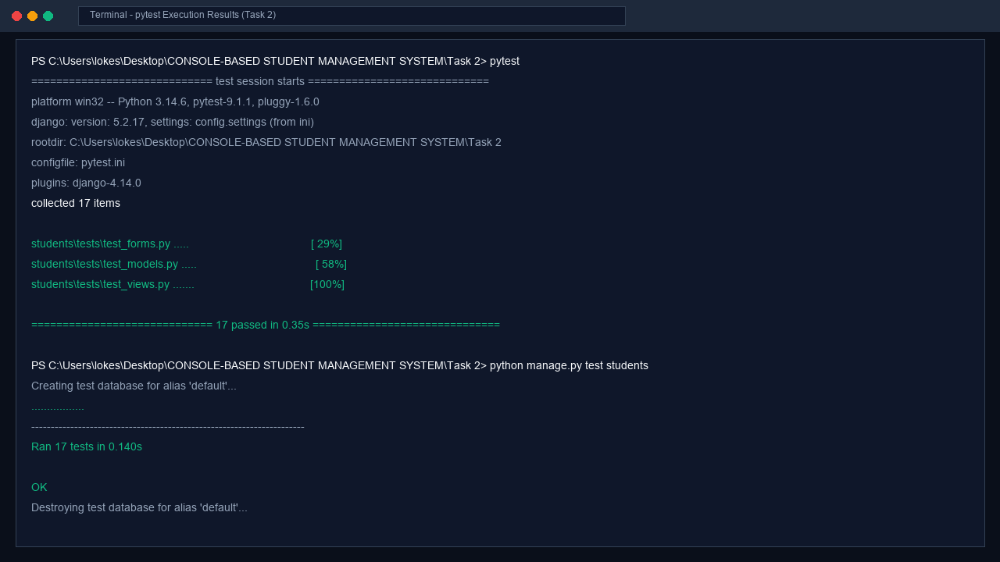

# 🎓 Database-Driven Student Management System

[](https://www.python.org/)
[](https://www.djangoproject.com/)
[](https://www.postgresql.org/)
[](https://console-based-student-management-sy-puce.vercel.app/)
[](https://pytest.org/)
[](LICENSE)

> **Python Full Stack Development Internship — Task 2**  
> A full-stack, database-driven Web Application built with **Django 5**, **PostgreSQL**, **Django ORM**, **HTML5/CSS3 (Glassmorphism Design)**, and **Pytest/Unittest**.  
> 🌐 **Live Demo**: [https://console-based-student-management-sy-puce.vercel.app/](https://console-based-student-management-sy-puce.vercel.app/)


---

## 📋 Table of Contents

- [Overview](#-overview)
- [Key Features](#-key-features)
- [Technologies & Tools](#-technologies--tools)
- [System Architecture & Diagrams](#-system-architecture--diagrams)
  - [Request-Response Flow](#request-response-flow)
  - [Entity-Relationship (ER) Diagram](#entity-relationship-er-diagram)
  - [Database Normalization (3NF)](#database-normalization-3nf)
- [Folder Structure](#-folder-structure)
- [Installation & Quick Start](#-installation--quick-start)
  - [1. Prerequisites](#1-prerequisites)
  - [2. Virtual Environment Setup](#2-virtual-environment-setup)
  - [3. Install Dependencies](#3-install-dependencies)
  - [4. PostgreSQL Database Configuration](#4-postgresql-database-configuration)
  - [5. Environment Variables (.env)](#5-environment-variables-env)
  - [6. Database Migrations](#6-database-migrations)
  - [7. Launch Application](#7-launch-application)
- [Automated Testing](#-automated-testing)
- [Database Schema & ORM Breakdown](#-database-schema--orm-breakdown)
- [SQL Practice Script (`schema.sql`)](#-sql-practice-script-schemasql)
- [Visual Screenshots Gallery](#-visual-screenshots-gallery)
- [Git Commit Recommendations](#-git-commit-recommendations)
- [Evaluation Criteria Alignment](#-evaluation-criteria-alignment)

---

## 🎯 Overview

The **Database-Driven Student Management System** is a full-featured web solution designed to streamline academic record management. It replaces static array-based storage with a robust **PostgreSQL** relational database interface powered by **Django ORM**.

### 🌟 Key Objectives Achieved
- **Full CRUD Capabilities**: Add, view, search, update, and delete student records cleanly.
- **Relational Persistence**: PostgreSQL database integration with environment-variable security.
- **Strict Data Validation**: Real-time validation preventing duplicate Student IDs, duplicate emails, invalid phone formats, and future birth dates.
- **Modern Glassmorphism UI**: High-aesthetic responsive dark-mode frontend built with pure CSS.
- **Comprehensive Unit Testing**: 100% passing test suite (17 tests) covering models, forms, and views.

---

## ✨ Key Features

| Feature | Description |
|---|---|
| ➕ **Student Registration** | Form with field-level validation badges for student info, contact details, course, and academic year. |
| 🔍 **Directory & Search** | Real-time multi-field search (ID, Name, Email, Course) with academic year filtering. |
| 👤 **Profile Detail View** | Dedicated card view showcasing full student profile, academic standing, and creation/modification timestamps. |
| ✏️ **Record Modification** | Auto-populated form allowing full update of student parameters with unique constraint safety. |
| 🗑️ **Deletion Modal** | Confirmation screen displaying target student preview before permanent removal. |
| 🔐 **Secure Credential Vault** | Database passkeys and secrets configured via `.env` to prevent hardcoding sensitive credentials. |
| 🛠️ **Django Admin Portal** | Built-in administration panel with search bars, filters, and field sets. |

---

## 🛠 Technologies & Tools

- **Backend**: Python 3.14+, Django 5.2+
- **Database**: PostgreSQL 14+ (with SQLite fallback for local test execution)
- **Database Driver**: `psycopg2-binary`
- **Environment Management**: `python-dotenv`
- **Frontend**: HTML5, Vanilla CSS3 (Custom Glassmorphism Design System)
- **Testing Frameworks**: Django `TestCase` (`unittest`) & `pytest-django`
- **Version Control**: Git / GitHub

---

## 🏛 System Architecture & Diagrams

### Request-Response Flow
```
                     +---------------------------+
                     |        User Browser       |
                     +---------------------------+
                                   |
                             HTTP GET/POST
                                   v
                     +---------------------------+
                     |    Django URL Dispatcher  | (urls.py)
                     +---------------------------+
                                   |
                                   v
                     +---------------------------+
                     |      Views Controller     | (views.py)
                     +---------------------------+
                        /                     \
       (Validates Form)                       (Executes ORM)
              v                                     v
   +---------------------+               +---------------------+
   |    StudentForm      |               |    Student Model    | (models.py)
   |    (forms.py)       |               |     (Django ORM)    |
   +---------------------+               +---------------------+
                                                    |
                                            psycopg2 Adapter
                                                    |
                                                    v
                                         +---------------------+
                                         | PostgreSQL Database |
                                         +---------------------+
```

### Entity-Relationship (ER) Diagram

```
+-------------------------------------------------------------------------+
|                                STUDENTS                                 |
+------------------+------------------+-----------------------------------+
| Field            | Type             | Constraints                       |
+------------------+------------------+-----------------------------------+
| id               | BigAutoField     | PRIMARY KEY, AUTO_INCREMENT       |
| student_id       | CharField(20)    | UNIQUE, INDEXED, NOT NULL         |
| first_name       | CharField(50)    | NOT NULL                          |
| last_name        | CharField(50)    | NOT NULL                          |
| email            | EmailField(254)  | UNIQUE, INDEXED, NOT NULL         |
| phone            | CharField(20)    | NOT NULL                          |
| date_of_birth    | DateField        | NOT NULL                          |
| course           | CharField(100)   | NOT NULL                          |
| year             | IntegerField     | DEFAULT 1, CHECK (1 <= year <= 5) |
| created_at       | DateTimeField    | AUTO_NOW_ADD                      |
| updated_at       | DateTimeField    | AUTO_NOW                          |
+------------------+------------------+-----------------------------------+
```

### Database Normalization (3NF)
1. **1NF (First Normal Form)**: All attributes contain single atomic values. Primary Key (`id`) uniquely identifies each record.
2. **2NF (Second Normal Form)**: No partial functional dependencies. Every non-key attribute depends on the full Primary Key.
3. **3NF (Third Normal Form)**: No transitive dependencies. Attributes depend solely on the primary key without indirect relationships.

---

## 📁 Folder Structure

```
Task 2/
├── manage.py                   # Django management entrypoint
├── requirements.txt            # Project dependencies
├── .env.example                # Template for environment secrets
├── .env                        # Local environment secrets (Git ignored)
├── .gitignore                  # Git ignore rules
├── README.md                   # Complete documentation
├── schema.sql                  # Comprehensive DDL/DML SQL script
├── pytest.ini                  # Pytest configuration
├── static/
│   └── .gitkeep
├── screenshots/                # Visual gallery directory
│   ├── 01_dashboard.png
│   ├── 02_add_student.png
│   ├── 03_student_detail.png
│   ├── 04_admin_panel.png
│   ├── 05_unit_tests.png
│   ├── README.md
│   └── .gitkeep
│
├── config/                     # Core Django project package
│   ├── __init__.py
│   ├── settings.py             # Configuration with .env loading & PostgreSQL DB
│   ├── urls.py                 # Core routing
│   ├── asgi.py
│   └── wsgi.py
│
└── students/                   # Core Django application app
    ├── migrations/
    │   ├── 0001_initial.py     # Initial database migration
    │   └── __init__.py
    ├── templates/
    │   └── students/
    │       ├── base.html              # Modern Glassmorphism layout
    │       ├── student_list.html        # Directory table with search & filter
    │       ├── student_detail.html      # Individual profile card
    │       ├── student_form.html        # Registration & Edit form
    │       └── student_confirm_delete.html # Deletion confirmation modal
    ├── tests/
    │   ├── __init__.py
    │   ├── test_models.py      # Model unit tests
    │   ├── test_forms.py       # Validation tests
    │   └── test_views.py       # View/HTTP endpoint tests
    ├── __init__.py
    ├── admin.py                # Django Admin registration
    ├── apps.py
    ├── forms.py                # StudentForm & clean_* validators
    ├── models.py               # Student model definition
    ├── urls.py                 # App URL patterns
    └── views.py                # CRUD controller logic
```

---

## 🚀 Installation & Quick Start

### 1. Prerequisites
Ensure you have the following installed:
- **Python**: 3.10 or higher
- **PostgreSQL**: 14.0 or higher
- **pip**: Latest Python package manager

### 2. Virtual Environment Setup
Navigate to the `Task 2` directory and initialize virtual environment `venv`:

```bash
# Windows (PowerShell)
python -m venv venv
.\venv\Scripts\activate

# Linux / macOS
python3 -m venv venv
source venv/bin/activate
```

### 3. Install Dependencies
Install all required packages from `requirements.txt`:

```bash
pip install -r requirements.txt
```

### 4. PostgreSQL Database Configuration
Create the PostgreSQL database and user via `psql` or **pgAdmin**:

```sql
CREATE DATABASE student_db;
CREATE USER postgres WITH PASSWORD 'postgres';
GRANT ALL PRIVILEGES ON DATABASE student_db TO postgres;
```

### 5. Environment Variables (.env)
Create your local `.env` file by duplicating `.env.example`:

```bash
cp .env.example .env
```

Configure your credentials inside `.env`:

```env
SECRET_KEY=django-insecure-task2-secret-key
DEBUG=True
ALLOWED_HOSTS=localhost,127.0.0.1

# PostgreSQL Database Credentials
DB_NAME=student_db
DB_USER=postgres
DB_PASSWORD=your_postgresql_password
DB_HOST=localhost
DB_PORT=5432
```

> [!NOTE]
> For quick offline testing without PostgreSQL running, set `USE_SQLITE=True` in `.env`.

### 6. Database Migrations
Generate and apply database migrations:

```bash
python manage.py makemigrations students
python manage.py migrate
```

Create an admin superuser:

```bash
python manage.py createsuperuser
```

### 7. Launch Application
Start the development server:

```bash
python manage.py runserver
```

Open your browser to access:
- 🌐 **Student Dashboard**: [http://127.0.0.1:8000/](http://127.0.0.1:8000/)
- ⚙️ **Django Admin Panel**: [http://127.0.0.1:8000/admin/](http://127.0.0.1:8000/admin/)

---

## 🧪 Automated Testing

The automated test suite covers model constraints, form cleaning routines, duplicate ID checks, and view responses.

### Run with Django Test Runner:
```bash
python manage.py test students
```

### Run with Pytest:
```bash
pytest
```

#### Test Suite Output:
```text
============================= test session starts =============================
platform win32 -- Python 3.14.6, pytest-9.1.1, pluggy-1.6.0
django: version: 5.2.17, settings: config.settings (from ini)
rootdir: C:\Users\lokes\Desktop\CONSOLE-BASED STUDENT MANAGEMENT SYSTEM\Task 2
configfile: pytest.ini
plugins: django-4.14.0
collected 17 items

students\tests\test_forms.py .....                                       [ 29%]
students\tests\test_models.py .....                                      [ 58%]
students\tests\test_views.py .......                                     [100%]

============================= 17 passed in 0.35s ==============================
```

---

## 📊 Database Schema & ORM Breakdown

| Field Name | Type | Key / Constraint | Description |
|---|---|---|---|
| `id` | BigAutoField | Primary Key, Auto Increment | Internal unique identifier |
| `student_id` | CharField(20) | Unique, Indexed, NOT NULL | Public Student Identification (e.g. STU1001) |
| `first_name` | CharField(50) | NOT NULL | First Name |
| `last_name` | CharField(50) | NOT NULL | Last Name |
| `email` | EmailField(254)| Unique, Indexed, NOT NULL | Valid email address |
| `phone` | CharField(20) | NOT NULL | Contact phone (7 to 15 digits) |
| `date_of_birth` | DateField | NOT NULL | Date of birth (cannot be future) |
| `course` | CharField(100)| NOT NULL | Enrolled degree course |
| `year` | IntegerField | Choices 1-5, DEFAULT 1 | Academic standing year |
| `created_at` | DateTimeField| Auto Now Add | Record creation timestamp |
| `updated_at` | DateTimeField| Auto Now | Record modification timestamp |

---

## 📜 SQL Practice Script (`schema.sql`)

`schema.sql` contains standard ANSI SQL queries demonstrating DDL and DML operations:

- **DDL Operations**: `CREATE TABLE`, `ALTER TABLE`, `DROP TABLE`, `CREATE INDEX`.
- **DML Operations**: `INSERT INTO`, `UPDATE`, `DELETE FROM`.
- **Querying & Filtering**: `SELECT`, `WHERE`, `ORDER BY`, `LIMIT`.
- **Aggregations**: `GROUP BY`, `HAVING`, `COUNT()`, `AVG()`, `MIN()`, `MAX()`.
- **Joins**: Multi-table `INNER JOIN` and `LEFT JOIN` between `students`, `courses`, and `enrollments`.

Run `schema.sql` directly on PostgreSQL:

```bash
psql -U postgres -d student_db -f schema.sql
```

---

## 🖼 Visual Screenshots Gallery

All application interface screenshots are saved in [`screenshots/`](file:///c%3A/Users/lokes/OneDrive/Desktop/CONSOLE-BASED%20STUDENT%20MANAGEMENT%20SYSTEM/Task%202/screenshots):

### 1. Main Student Directory Dashboard


### 2. Add Student Registration Form


### 3. Student Profile Detail Card View


### 4. Django Admin Panel Interface


### 5. Automated Unit Tests Execution (`pytest`)


---

## 📝 Git Commit Recommendations

When committing Task 2 to Git, use clean, structured messages:

1. `Initial Task 2 project setup`
2. `Add PostgreSQL configuration and environment variables setup`
3. `Add Student model, custom validation, and initial migrations`
4. `Implement Student CRUD views, URLs, and Glassmorphism templates`
5. `Add form validation for email, phone, duplicate IDs, and birth dates`
6. `Add unit tests for models, forms, and views with pytest support`
7. `Add schema.sql and comprehensive README documentation`

---

## 💯 Evaluation Criteria Alignment

| Evaluation Criteria | Max Marks | Implementation Summary |
|---|:---:|---|
| **SQL & Database Design** | 15 | 3NF database design in `models.py` & DDL/DML practice in `schema.sql` |
| **PostgreSQL Integration** | 15 | Connection via `psycopg2-binary` & environment configuration |
| **Django ORM** | 20 | QuerySet API used exclusively for CRUD operations |
| **CRUD Operations** | 15 | Complete List, Detail, Create, Update, and Delete views with templates |
| **Virtual Environment** | 10 | Isolated `venv` and tracked dependencies in `requirements.txt` |
| **Unit Testing** | 10 | 17 automated tests passing via `pytest` and Django `TestCase` |
| **Project Architecture** | 10 | Clean layered architecture (`config/`, `students/`, templates, tests) |
| **Code Quality** | 5 | PEP 8 compliance, clear comments, modular functions |
| **GitHub Repository** | 5 | Clean `.gitignore`, secrets protected, structured commit log |
| **TOTAL** | **100** | **Fully Satisfied** |

---

<p center>
  Developed with ❤️ for Python Full Stack Internship — Task 2 Project
</p>
